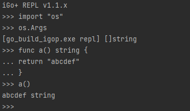

# Gos

Golang/[Go+](https://goplus.org/) interpreter. Base on [igop v0.27.1](https://github.com/goplus/igop)

## ✨ Feature highlights
- Run the Golang **WITHOUT** [Golang compiler](https://go.dev/dl/)(150MB+)
- Only 14MB after built and [UPX -9](https://github.com/upx/upx)


- [x] Go+ script file,
- [x] Golang file
- [x] Golang project
- [X] Golang project in an archive file of `*.tar.gz`, `*.tar.xz`, ...
- [X] Support shebang line, like `#!/usr/bin/bash`
- [X] **Go1.18~1.22 generics**
- [ ] `main.go` in the subdirectory
- [ ] `*.asm` file support

## TOC

- Run golang files
  - [Usage](#-run-golang-files)
  - [Single file mode](#single-file-mode)
  - [Project mode](#project-mode)
  - [Archive mode](#archive-mode)
- [Execute code](#execute-code)
- [REPL](#repl)
- [Run as shell file](#run-as-shell-file-like-sh)

## ⌛ Run Golang files 

```
gos run <PATH> 
  [-V | --debug]
  -- <arguments>
```

Run a [Go+ script](https://goplus.org/), or a Golang project

|                 | Type      | Default       |                                                                                                |
|-----------------|-----------|---------------|------------------------------------------------------------------------------------------------|
| \<PATH>         | String    |               | File of Golang+ script, "*.gop". <br/>Directory of Golang project.                             |
| -V<br/>--debug  | Boolean   | false         | Print the debug information.                                                                   |
| -- \<arguments> |           |               | arguments for script.<br/>Be read `os.Args` in the script.                                     |

<details>
  <summary>Advanced options</summary>

- `--vendor`: The path of Golang dependency packages.

  `gos run . --vendor=/path/to/vendor`

- `-I | --import <NAME=PATH>`: The package to be imported. 
  
  `gos run . -I mathex=/path/to/mathx -I json2=/path/to/json2`

- `-p | --plugin <path>`: (Only for linux)Load the "*.so" of golang plugin
  
  `gos run . --plugin /path/to/plugin1.so --plugin /path/to/plugin2.so`

  See https://github.com/go-mixed/gops_plugins

</details>

### Single file mode

Run a file with `*.gop`、`*.go`

> `.go` must be `package main` and includes `func main()`
>
> See [examples/example2/1.go](examples/example2/1.gop)、[examples/example2/2.go](examples/example2/2.go)

Run
```bash
gos run /path/to/file.gop 
```

Run in the working directory
```bash
cd /path/to
gos run file.gop
```

With arguments
```bash
gos run file.gop -- --abc 123 --def
```


### Project mode

#### 1. Simple and flattened project 

- Must be `package main` and One `func main()` in the working directory
- The `gop` file implicitly contains a `func main()`, which is why only one `gop` file is allowed.


```
/path/to/
 - func.go
 - func.gop
 - main.go
```

>  See [examples/example3](examples/example3)

Run

```bash
gos run /path/to/examples/example3
```

Run in the working directory
```bash
cd /path/to/examples/example3
gos run .
```

With arguments
```bash
gos run . -- --abc 123 --def
```

#### 2. Project with submodules, or 3<sup>rd</sup> party modules.

- No allowed `*.gop`
- `go.mod` MUST be in the working directory
- `vendor/modules.txt` MUST be in the working directory, if you need 3rd-party modules

```
/path/to
  - main.go
  - func/
    - func.go
  - go.mod
  - vensor/  <--- if you need 3rd-party modules
    - modules.txt
```

> See [examples/example1/](examples/example1)

### Archive mode

A packaging of project 

Supported archive format. When it runs, it'll actually be extract to `examples/__FILE_NAME__`

- tar.gz
- tar.bzip2
- tar.xz
- zip
- tar

> See [examples/example5.tar.gz](examples/example5.tar.gz)

Run an archive
```bash
gos run examples/example5.tar.gz
```

With arguments
```bash
gos run examples2/2.go -- --abc 123 --def
```

## ⚡ Execute code
```
gos exec 
  [-s | --script <code>] 
  [--debug] 
  -- <script arguments>
```
Execute script code from **StdIn** or the argument of "--script"

|                         | Type   | Default |                                                            |
|-------------------------|--------|---------|------------------------------------------------------------|
| -V<br/>--debug          |        | false   | Print the debug information.                               |
| -s<br/>--script \<code> | String |         | The Golang/Go+ script as string                            |
| -- \<arguments>         |        |         | arguments for script.<br/>Be read `os.Args` in the script. |

### Example

#### Code from StdIn

```bash
gos exec < example2/1.gop
```

```bash
cat example2/1.gop | gos exec
```

```bash
echo "i := 1+2; println(i)" | gos exec
printf "i := 1+2 \n println(i)" | gos exec
```

#### Code in argument "-s"

```
$ gos exec -s "i := 1+2; println(i)"
```

> Use `;`(semicolons) instead of carriage returns

## REPL
```
gos repl
```
A [Go+](https://goplus.org/) Read Eval Print Loop

Online: [https://repl.goplus.org/](https://repl.goplus.org/)



## Run as shell file, like "*.sh"

Shebang line:

script.sh
```
///usr/bin/true; exec /usr/bin/gos run -- "$0" "$@"

import "os"
import "fmt"

fmt.Printf("%v", os.Args)
```

> The first two lines are important

Run
```
$ chmod +x ./script.sh

$ ./scrpit.sh --argument1 --argument2
$ sh ./script.sh --argument1 --argument2
```

Print
```
[./script.sh.gop --argument1 --argument2]
```

# Development

## Install dependencies

```shell
go install github.com/goplus/igop/cmd/qexp@latest
```

## Build build-in scripts

```shell
cd pkgs
qexp -outdir . -filename go_export github.com/inconshreveable/mousetrap github.com/spf13/pflag github.com/spf13/cobra go.uber.org/multierr gopkg.in/yaml.v3 github.com/pkg/errors

cd ..
go build
```
